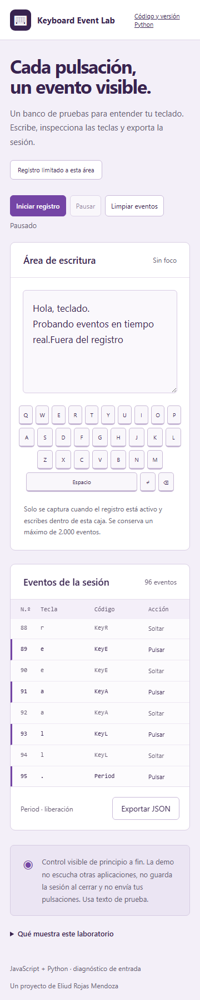

<div align="center">

# Keyboard Event Lab

Un espacio para escribir, observar eventos de teclado y exportar una sesión, disponible en el navegador y como aplicación Python.

<a href="https://enybyy.github.io/keyboard-event-lab/"></a>

<p><a href="https://github.com/Enybyy"></a>
<a href="https://www.linkedin.com/in/eliud-rojas-mendoza-414652212/"></a>
<a href="https://www.upwork.com/freelancers/~01471ca462b236e8e5"></a></p>

[](https://enybyy.github.io/keyboard-event-lab/)

*Captura real del laboratorio. El registro se limita a su propia área de escritura.*

[Acerca del proyecto](#acerca-del-proyecto) · [Capturas](#capturas) · [Uso e instalación](#uso-e-instalación)

</div>

## Acerca del proyecto

Al escribir en el área de prueba, el teclado visual y la consola muestran lo que recibe la aplicación: tecla, código, modificadores y pulsación o liberación. La sesión se inicia de forma explícita y puede pausarse, limpiarse o exportarse.

La relación entre una acción y su evento queda a la vista. Esto permite explorar el comportamiento de la entrada de texto y revisar sesiones acotadas, con una versión de escritorio en Python para recorrer el mismo tipo de interacción.

## Capturas

<details>
<summary><strong>El laboratorio en móvil</strong></summary>



</details>

## Uso e instalación

<details>
<summary><strong>Ver el recorrido, las instrucciones y las notas técnicas</strong></summary>

## Ejecutar

La demo no requiere instalación. Para servirla localmente:

```powershell
python -m http.server 5086 --bind 127.0.0.1
```

Abre `http://127.0.0.1:5086`. La versión de escritorio requiere Python 3.12+ con Tkinter:

```powershell
python app.py
```

Tkinter forma parte del instalador habitual de Python para Windows. Algunas distribuciones Linux requieren instalar su paquete Tk.

## Uso

1. Pulsa **Iniciar registro** y escribe dentro del área de prueba.
2. Inspecciona la tecla, el código físico y la acción de pulsar/soltar.
3. Pulsa **Pausar**, **Limpiar eventos** o **Exportar JSON**.

La versión web conserva los últimos 2.000 eventos e incluye modificadores, timestamp y repetición. La versión Python registra pulsaciones con nombre de tecla, carácter y timestamp. Los controles y otras ventanas quedan fuera del registro. La información vive en memoria; solo se guarda si eliges exportarla.

## Alcance

Este proyecto reemplaza el antiguo `KeyLogger` de la suite por un laboratorio de entrada visible. No usa hooks globales, `pynput`, escucha de otras aplicaciones, transmisión de datos ni ejecución oculta. Cerrar la página o ventana termina la sesión. Usa texto de prueba.

Los navegadores no informan todas las combinaciones reservadas del sistema operativo. El teclado ilustrado cubre letras, espacio, Enter y retroceso; la consola puede mostrar otros eventos que el navegador entregue. Pegado, dictado e IME pueden insertar texto sin una pulsación por carácter.

## Pruebas

```powershell
python -m unittest discover -s tests -v
```

Los tests verifican inicio/pausa, límite de historial, secuencia, limpieza y exportación Unicode. `scripts/browser-test.cjs` verifica el flujo real de entrada, pausa, exclusión de controles, exportación y ancho móvil usando Playwright y toma las capturas del producto.

## English

A visible keyboard event workbench with a browser demo and a small Python/Tkinter desktop application. It captures only its own focused input, requires an explicit start, keeps bounded in-memory history, and exports JSON on request. It does not monitor other applications.

</details>

---

<div align="center">

**Eliud Rojas Mendoza · Enybyy**

<p><a href="https://github.com/Enybyy"></a>
<a href="https://www.linkedin.com/in/eliud-rojas-mendoza-414652212/"></a>
<a href="https://www.upwork.com/freelancers/~01471ca462b236e8e5"></a></p>

</div>
