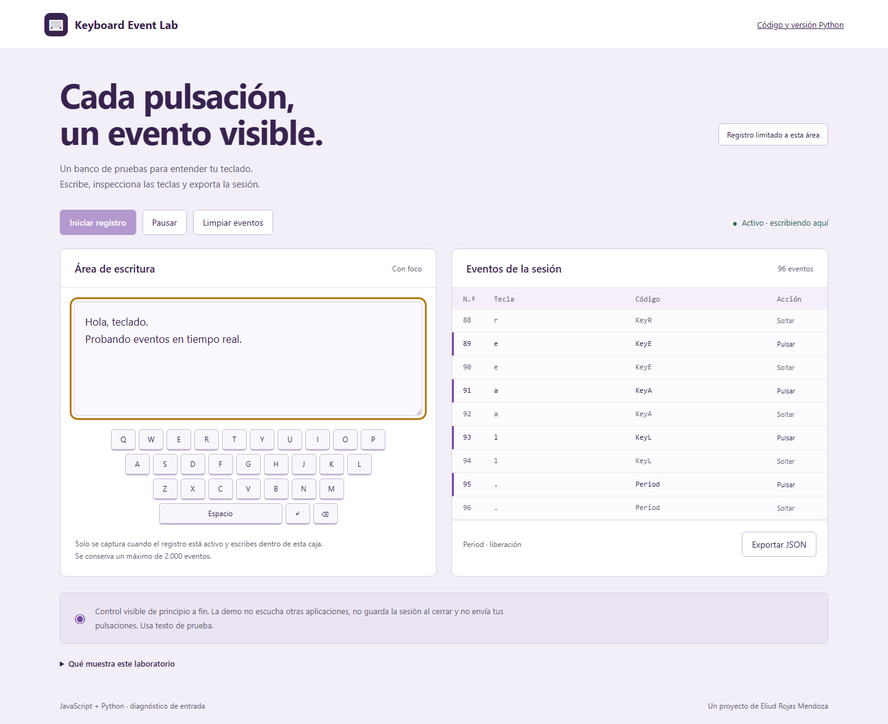

<div align="center">

# Keyboard Event Lab

Un espacio para escribir, observar eventos de teclado y exportar una sesión, disponible en el navegador y como aplicación Python.

<a href="https://enybyy.github.io/keyboard-event-lab/"></a>

<p><a href="https://github.com/Enybyy"></a>
<a href="https://www.linkedin.com/in/eliud-rojas-mendoza-414652212/"></a>
<a href="https://www.upwork.com/freelancers/~01471ca462b236e8e5"></a></p>

[](https://enybyy.github.io/keyboard-event-lab/)

*Captura real del laboratorio. El registro se limita a su propia área de escritura.*

[Acerca del proyecto](#acerca-del-proyecto) · [Recorrido](#en-el-día-a-día) · [Tecnología](#cómo-está-construido) · [Uso local](#uso-local)

</div>

## Acerca del proyecto

El texto que aparece en un campo no muestra por sí solo cómo se recibió cada pulsación. Keyboard Event Lab coloca el área de escritura junto a un teclado visual y una consola para observar la relación entre lo que se escribe y los eventos que recibe la aplicación.

El registro se inicia de forma explícita, puede pausarse y conserva una sesión acotada. La exportación JSON permite revisar los eventos fuera del laboratorio, útil para explorar comportamientos de entrada y probar interacciones. La versión Python ofrece el mismo tipo de espacio de trabajo en su propia ventana.

## En el día a día

| Dentro del proyecto | Detalle |
| --- | --- |
| Entrada visible | Registro iniciado expresamente dentro de su propia área de escritura. |
| Inspección de eventos | Tecla, código físico, modificadores, repetición y acción en la versión web. |
| Control de la sesión | Inicio, pausa, limpieza y un historial acotado de eventos. |
| Exportación | Sesión JSON para consultar fuera del laboratorio. |
| Versión de escritorio | Aplicación Python/Tkinter con registro de pulsaciones en su propia ventana. |

## Explorar la demo

1. Pulsa **Iniciar registro** y escribe dentro del área de prueba.
2. Inspecciona la tecla, el código físico y la acción de pulsar/soltar.
3. Pulsa **Pausar**, **Limpiar eventos** o **Exportar JSON**.

La versión web conserva los últimos 2.000 eventos e incluye modificadores, timestamp y repetición. La versión Python registra pulsaciones con nombre de tecla, carácter y timestamp. Los controles y otras ventanas quedan fuera del registro. La información vive en memoria; solo se guarda si eliges exportarla.

## Alcance

Este proyecto reemplaza el antiguo `KeyLogger` de la suite por un laboratorio de entrada visible. No usa hooks globales, `pynput`, escucha de otras aplicaciones, transmisión de datos ni ejecución oculta. Cerrar la página o ventana termina la sesión. Usa texto de prueba.

Los navegadores no informan todas las combinaciones reservadas del sistema operativo. El teclado ilustrado cubre letras, espacio, Enter y retroceso; la consola puede mostrar otros eventos que el navegador entregue. Pegado, dictado e IME pueden insertar texto sin una pulsación por carácter.

## Cómo está construido

| Área | Tecnología |
| --- | --- |
| Demo web | HTML, CSS y JavaScript |
| Aplicación de escritorio | Python y Tkinter |
| Sesiones | Historial en memoria y exportación JSON |
| Verificación | unittest y Playwright |

## Uso local

<details>
<summary><strong>Ejecutar en tu equipo</strong></summary>

La demo no requiere instalación. Para servirla localmente:

```powershell
python -m http.server 5086 --bind 127.0.0.1
```

Abre `http://127.0.0.1:5086`. La versión de escritorio requiere Python 3.12+ con Tkinter:

```powershell
python app.py
```

Tkinter forma parte del instalador habitual de Python para Windows. Algunas distribuciones Linux requieren instalar su paquete Tk.

</details>

<details>
<summary><strong>Pruebas</strong></summary>

```powershell
python -m unittest discover -s tests -v
```

Los tests verifican inicio/pausa, límite de historial, secuencia, limpieza y exportación Unicode. `scripts/browser-test.cjs` verifica el flujo real de entrada, pausa, exclusión de controles, exportación y ancho móvil usando Playwright y toma las capturas del producto.

</details>

<details>
<summary><strong>English</strong></summary>

A visible keyboard event workbench with a browser demo and a small Python/Tkinter desktop application. It captures only its own focused input, requires an explicit start, keeps bounded in-memory history, and exports JSON on request. It does not monitor other applications.

</details>

---

<div align="center">

**Eliud Rojas Mendoza · Enybyy**

<p><a href="https://github.com/Enybyy"></a>
<a href="https://www.linkedin.com/in/eliud-rojas-mendoza-414652212/"></a>
<a href="https://www.upwork.com/freelancers/~01471ca462b236e8e5"></a></p>

</div>
